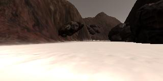

### Writeup / README

#### 1. Provide a Writeup / README that includes all the rubric points and how you addressed each one.  You can submit your writeup as markdown or pdf.  

### Notebook Analysis
#### 1. Run the functions provided in the notebook on test images (first with the test data provided, next on data you have recorded). Add/modify functions to allow for color selection of obstacles and rock samples.
Here is my example image!

#### 1. Populate the `process_image()` function with the appropriate analysis steps to map pixels identifying navigable terrain, obstacles and rock samples into a worldmap.  Run `process_image()` on your test data using the `moviepy` functions provided to create video output of your result. 

[Here is my video!](output/test_mapping.mp4)

### Autonomous Navigation and Mapping

#### 1. Fill in the `perception_step()` (at the bottom of the `perception.py` script) and `decision_step()` (in `decision.py`) functions in the autonomous mapping scripts and an explanation is provided in the writeup of how and why these functions were modified as they were.

#### 2. Launching in autonomous mode your rover can navigate and map autonomously.  Explain your results and how you might improve them in your writeup.  

**Note: running the simulator with different choices of resolution and graphics quality may produce different results, particularly on different machines!  Make a note of your simulator settings (resolution and graphics quality set on launch) and frames per second (FPS output to terminal by `drive_rover.py`) in your writeup when you submit the project so your reviewer can reproduce your results.**

Sim Settings:
Screen resolution: 960 x 640
Graphics Quality: Fastest
FPS: 18 to 19

**Approach**:
I followed the steps as outlined in the perception_step function. The only additions 
I made were to add thresholding for the test samples, and add this to the green
channel of the mapping images.
I kept the majority of the logic in decision_step function, but I ran with the
suggestion of trying to get the rover to follow along the left wall. I used very simple logic to acheive this (it doesn't work very well). The steps are to check if there is
navigable terrain to the far left (beyond some angle threshold), and if so, turn
left, otherwise use the average angle. I also added additional logic to
stop the rover if there is no navigable terrain directly infront of it. This
helps to call the 'stop and turn right' functionality that runs when the rover
gets stuck.

**Failure Modes**:
There are innumerous fail cases for this algorithm, but they usually involve
object interfering with the rover that are not in its field of view, or running
one wheel up on terrain that is not navaigable.

**Improvements**:
If I were to improve this project further, I would make use of the fact that 
position and orientation of the rover is known perfectly. To improve on this algorithm
I would make the rover traverse the left wall at a fixed distance, with an angle parallel to the wall. Also more logic would be necessary to handle fail cases, such as when a rock or object is direcly in-front of the rover.
